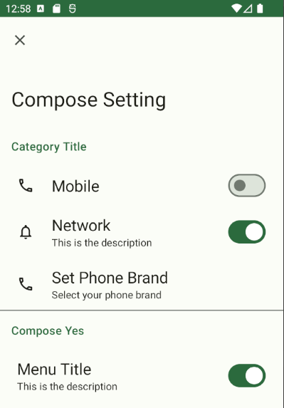

# ComposeSetting


This is a basic Compose setting library that provides a basic [Material3](https://m3.material.io) setting components
It also provides a persistent state system based on [MMKV](https://github.com/Tencent/MMKV). 
Compared with SharedPreference/DataStore, it can **support synchronous reading without loss of performance**

## Features
* Remember Preference
* Material3 Setting Component
* High Performance
* Support Synchronous Reading/Writing

## Screenshot


## Import to your project
1. Import jitpack to your repository
```groovy
repositories {
    maven {
        url 'https://jitpack.io'
    }
}
```
2. Import the library 
```groovy
implementation 'com.github.re-ovo:compose-setting:<latest-version>'
```

## Remember Preference
You should initialize the MMKV before using it.
```kotlin
// Call this function in your Application.onCreate()
initComposeSetting()
```

You can use `rememberXXXPreference` function, which can **persist** remember a certain value in Compose

```kotlin
val booleanPreference by rememberBooleanPreference(
key = "boolean_preference",
default = false
)
```

Other types of preference can be used as well, such as
* `rememberStringPreference`
* `rememberIntPreference`
* `rememberLongPreference`
* `rememberFloatPreference`
* `rememberDoublePreference`
* `rememberStringPreference`
* `rememberStringSetPreference`

If you want to read/write the preference synchronously without Compose context, you can use `mmkvPreference` 
to do that:
```kotlin
mmkvPreference.getBoolean("boolean_preference", false)
mmkvPreference.putBoolean("boolean_preference", true)
    ...
```

## Setting Components
This library provides several out-of-the-box setting item components

### SettingBooleanItem
This component is used to display a setting item with a boolean value

```kotlin
val booleanPref = rememberBooleanPreference(
    key = "boolean_preference",
    defaultValue = false
)
SettingBooleanItem(
    state = booleanPref,
    title = {
        Text("Network")
    },
    text = {
        Text("This is the description")
    },
    icon = {
        Icon(Icons.Outlined.Notifications, null)
    }
)
```


### SettingStringItem
This component is used to display a setting item with a string value

```kotlin
val stringPref = rememberStringPreference(
    key = "string_preference",
    defaultValue = "default"
)
SettingStringItem(
    state = stringPref,
    title = {
        Text("Set Phone Brand")
    },
    text = {
        Text("Select your phone brand")
    },
    icon = {
        Icon(Icons.Outlined.Phone, null)
    },
    stateRange = setOf(
        "Xiaomi", "Google", "Oppo"
    )
)
```


### SettingLinkItem
This component is used to display a basic setting item

```kotlin
SettingLinkItem(
    title = {
        Text("Network")
    },
    text = {
        Text("This is the description")
    },
    icon = {
        Icon(Icons.Outlined.Notifications, null)
    },
    onClick = {
        // do something by yourself
    }
)
```

### SettingItemCategory
This component is used to display a category of setting items

```kotlin
 SettingItemCategory(
    title = {
        Text(text = "Compose Yes")
    }
) {
    // Your Menu Items Here
}
```
